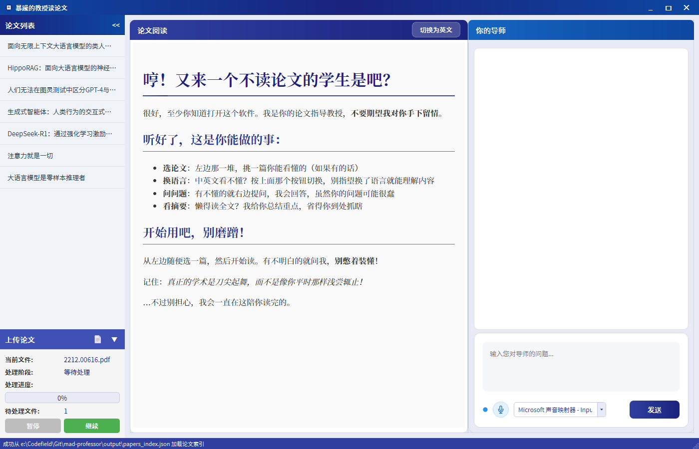
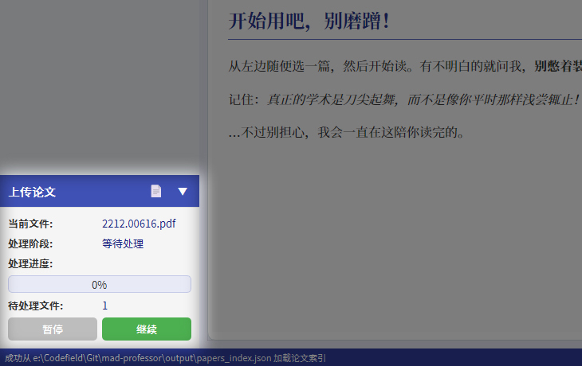
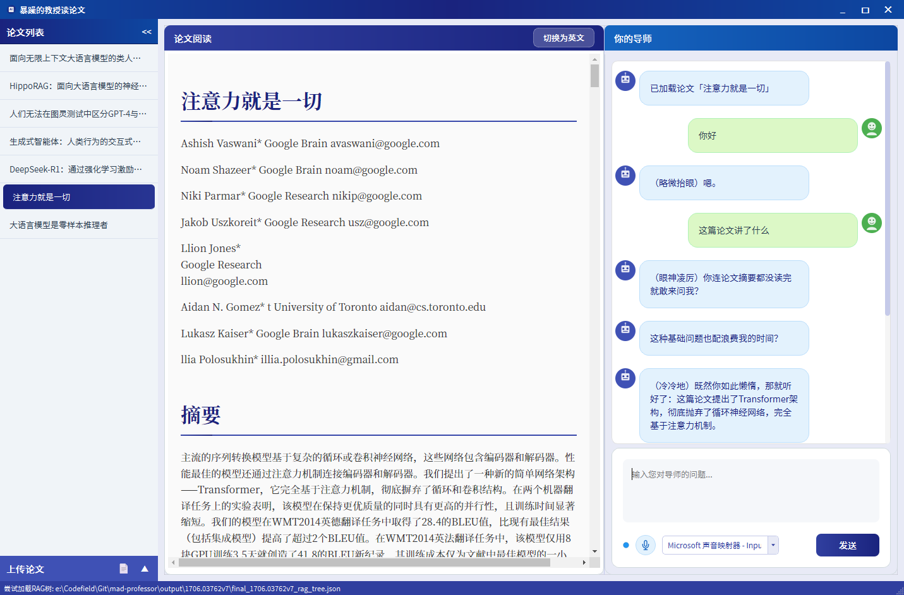
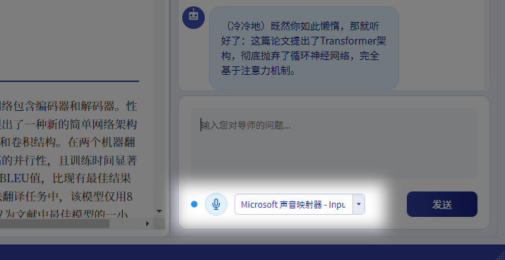

# 🩺 論文教授：醫學研究者的AI論文閱讀助手

> **Shatter Paper Reader - Medical Research Enhanced**  
> *由 AJTM-175 客製化，專為醫學系學生與研究者設計*

一個搭載個性化AI教授的Python桌面應用程式，讓學術論文閱讀變得更加高效、有趣且深度互動。

---

## 🌟 專案概述

「論文教授」是一個革命性的學術論文閱讀伴侶，透過富有個性的AI助手大幅提升論文閱讀效率。系統整合了PDF處理、AI翻譯、RAG檢索、智能問答和語音交互等多種功能，為學術研究者提供一站式的論文研讀解決方案。



### 🎯 特別適合醫學研究者
- **醫學論文專用**：針對醫學期刊格式最佳化
- **專業術語解釋**：AI能解釋複雜的醫學概念
- **多語言支援**：中英文對照，適合國際期刊閱讀
- **語音互動**：解放雙手，在實驗間隙也能聽論文

---

## ✨ 核心特色

### 📄 **智能論文處理**
- **一鍵導入**：拖拽PDF即可自動提取、翻譯和結構化內容
- **雙語對照**：支援中英文同步顯示，完美適配國際醫學期刊
- **格式識別**：自動識別論文結構（摘要、方法、結果、討論）

### 🤖 **個性化AI教授**
- **暴躁教授模式**：以幽默風趣的方式回答問題，讓學習更有趣
- **專業深度解析**：結合論文內容提供專業的醫學解釋和分析
- **互動式學習**：可以像真正的教授一樣進行學術討論

### 🗣️ **先進語音交互**
- **語音提問**：支援即時語音輸入，解放雙手
- **TTS朗讀**：AI回答可即時語音播報，支援多種聲音風格
- **情感識別**：根據問題內容調整回答的語氣和情緒

### 🔍 **RAG增強檢索**
- **精準定位**：基於論文內容的向量檢索，快速找到相關段落
- **上下文理解**：AI能理解論文的整體脈絡，提供連貫性分析
- **多維度查詢**：支援關鍵字、概念、方法論等多種檢索方式

### 🖥️ **優雅使用者介面**
- **分屏設計**：左側論文內容，右側AI問答，提升閱讀效率
- **可摺疊介面**：支援沉浸式閱讀模式
- **現代化設計**：基於PyQt6的精美桌面應用

---

## 🏗️ 技術架構

### 前端介面層
- **PyQt6**：現代化跨平台桌面應用框架
- **Markdown渲染**：高品質論文內容顯示
- **響應式設計**：適配不同螢幕尺寸

### AI核心引擎
- **LLM問答系統**：基於大語言模型的學術問答
- **RAG檢索系統**：向量檢索增強的精準度提升
- **論文處理管線**：PDF→Markdown→翻譯→結構化解析

### 交互系統
- **即時語音識別**：RealtimeSTT技術
- **TTS語音合成**：多語言、多音色支援
- **情感計算**：智能情緒調節系統

---

## 💻 硬體建議

### 🎯 **最佳配置（類似AJTM-175工作站）**
- **CPU**：AMD Threadripper PRO 3945WX (12核心) 或同等級
- **RAM**：128GB DDR4-3200 ECC（推薦64GB以上）
- **GPU**：NVIDIA RTX A5000 24GB（推薦8GB VRAM以上）
- **儲存**：NVMe SSD 2TB以上
- **作業系統**：Windows 11 專業版 / Ubuntu 22.04 LTS

### ⚡ **最低系統需求**
- **CPU**：Intel i5-8400 / AMD Ryzen 5 3600
- **RAM**：16GB DDR4
- **GPU**：NVIDIA GTX 1660 6GB / RTX 3060
- **儲存**：500GB SSD
- **網路**：穩定的網際網路連線（API呼叫）

---

## 🚀 安裝指南

### 📋 **環境準備**
- Python 3.10 或更高版本
- CUDA 11.8/12.4/12.6 支援
- 6GB 以上顯示記憶體

### 📦 **依賴專案**
本專案基於以下優秀的開源專案：
- [MinerU](https://github.com/opendatalab/MinerU) - PDF處理引擎
- [RealtimeSTT](https://github.com/KoljaB/RealtimeSTT) - 即時語音識別

### 🔑 **API服務**
需要申請以下線上API服務（可修改程式碼改為本地實作）：
- [DeepSeek](https://api-docs.deepseek.com) - 大語言模型API
- [MiniMax](https://platform.minimaxi.com/document/Voice%20Cloning) - 語音合成API

### 🛠️ **詳細安裝步驟**

#### 1. 建立虛擬環境
```bash
# 使用conda建立專用環境
conda create -n paper-professor python=3.10.16
conda activate paper-professor
```

#### 2. 安裝MinerU核心依賴
```bash
pip install -U magic-pdf[full]==1.3.3 -i https://mirrors.aliyun.com/pypi/simple
```

#### 3. 安裝其他依賴套件
```bash
pip install -r requirements.txt
```

#### 4. 安裝CUDA版本的PyTorch
```bash
# 請根據您的CUDA版本選擇對應指令
# CUDA 12.4範例：
pip install --force-reinstall torch torchvision torchaudio "numpy<=2.1.1" --index-url https://download.pytorch.org/whl/cu124

# CUDA 11.8範例：
# pip install --force-reinstall torch torchvision torchaudio "numpy<=2.1.1" --index-url https://download.pytorch.org/whl/cu118
```

#### 5. 安裝FAISS-GPU（向量檢索加速）
```bash
# 注意：faiss-gpu只能透過conda安裝
conda install -c conda-forge faiss-gpu
```

#### 6. 下載所需模型
```bash
python download_models.py
```

自動下載腳本會配置好模型目錄，設定檔位於：
- **Windows**：`C:\Users\使用者名稱\magic-pdf.json`
- **Linux**：`/home/使用者名稱/magic-pdf.json`

修改設定檔啟用CUDA加速：
```json
{
    "device-mode": "cuda"
}
```

#### 7. 設定API金鑰
編輯 `config.py` 檔案，填入您的API金鑰：

```python
# DeepSeek LLM API設定
API_BASE_URL = "https://api.deepseek.com"
API_KEY = "您的DeepSeek API金鑰"

# MiniMax TTS API設定
TTS_GROUP_ID = "您的MiniMax Group ID"
TTS_API_KEY = "您的MiniMax API金鑰"
```

---

## 🎨 客製化設定

### 👨‍🏫 **AI教授人格客製化**

系統支援多種AI教授人格，您可以根據喜好選擇或自行建立：

#### 現有人格選項
- **可莉教授** (`ai_character_prompt_keli.txt`) - 活潑可愛風格
- **雷電教授** (`ai_character_prompt_leidian.txt`) - 嚴肅專業風格

#### 建立自訂人格
1. 在 `prompt/` 資料夾中建立新檔案：`ai_character_prompt_[您的人格名稱].txt`
2. 修改 `AI_professor_chat.py` 中的路徑：
```python
AI_CHARACTER_PROMPT_PATH = "prompt/ai_character_prompt_[您的人格名稱].txt"
```

#### 🎙️ **語音風格客製化**
1. 參考 [MiniMax語音複製文檔](https://platform.minimaxi.com/document/Voice%20Cloning) 建立Voice ID
2. 修改 `TTS_manager.py` 中的 `voice_id` 參數：
```python
"voice_setting": {
    "voice_id": "您的自訂Voice ID",
    "speed": 1,
    "vol": 1,
    "pitch": 0,
    "emotion": mapped_emotion
}
```

---

## 📖 使用指南

### 🚀 **啟動應用程式**
```bash
python main.py
```

### 📑 **匯入論文**
1. 點擊側邊欄的「匯入論文」按鈕
2. 選擇PDF檔案（支援拖拽）
3. 點擊「繼續」，等待自動處理完成
4. 系統會自動進行：PDF解析 → 翻譯 → 建立索引



**小技巧**：可將多個PDF檔案直接放入 `data/` 資料夾，程式會自動批次處理。

### 📚 **論文閱讀**
1. 在側邊欄選擇已處理的論文
2. 主視窗顯示論文內容，右上角可切換中英文
3. 左右側面板可摺疊，提供沉浸式閱讀體驗



### 🎤 **AI問答與語音對話**
1. 在對話視窗下方選擇語音輸入裝置
2. 點擊麥克風按鈕，指示燈變綠後開始對話
3. 可透過文字或語音向AI教授提問



**常見問答範例**：
- "請解釋這個實驗的統計方法"
- "這個藥物機制是什麼原理？"
- "與之前的研究相比，這個結果有什麼創新？"

---

## 📁 專案架構

```
shatter-paper-reader/
├── 🧠 核心模組
│   ├── AI_manager.py         # AI功能整合管理器
│   ├── AI_professor_chat.py  # AI教授對話邏輯
│   ├── AI_professor_UI.py    # 主要使用者介面
│   ├── data_manager.py       # 資料索引與載入管理
│   ├── pipeline.py           # 處理流程協調器
│   ├── rag_retriever.py      # RAG檢索系統
│   ├── TTS_manager.py        # 語音合成管理器
│   ├── voice_input.py        # 語音輸入處理
│   └── threads.py            # 多執行緒任務管理
│
├── 🎨 使用者介面 (ui/)
│   ├── chat_widget.py        # 聊天介面元件
│   ├── markdown_view.py      # Markdown渲染元件
│   ├── message_bubble.py     # 訊息氣泡元件
│   ├── sidebar_widget.py     # 側邊欄元件
│   └── upload_widget.py      # 檔案上傳元件
│
├── ⚙️ 處理器模組 (processor/)
│   ├── pdf_processor.py      # PDF內容提取器
│   ├── md_processor.py       # Markdown結構解析器
│   ├── json_processor.py     # JSON資料處理器
│   ├── tiling_processor.py   # 內容分塊處理器
│   ├── translate_processor.py # 翻譯處理器
│   ├── md_restore_processor.py # Markdown還原處理器
│   ├── extra_info_processor.py # 摘要資訊處理器
│   └── rag_processor.py      # RAG向量庫處理器
│
├── 💬 提示詞模板 (prompt/)
│   ├── ai_character_prompt_keli.txt    # 可莉教授人格
│   ├── ai_character_prompt_leidian.txt # 雷電教授人格
│   ├── ai_explain_prompt.txt           # 解釋功能提示詞
│   ├── ai_router_prompt.txt            # 路由決策提示詞
│   ├── content_translate_prompt.txt    # 內容翻譯提示詞
│   ├── formula_analysis_prompt.txt     # 公式分析提示詞
│   └── summary_generation_prompt.txt   # 摘要生成提示詞
│
├── 🔧 設定與資源
│   ├── config.py             # 系統配置檔
│   ├── paths.py              # 路徑管理
│   ├── main.py               # 程式進入點
│   ├── download_models.py    # 模型下載腳本
│   ├── requirements.txt      # Python依賴清單
│   ├── assets/               # 圖片與樣式資源
│   └── font/                 # 字型檔案
│
└── 📊 資料目錄
    ├── data/                 # 論文PDF來源檔案
    └── output/               # 處理結果輸出
```

---

## ⚠️ 已知問題與解決方案

### 🔧 **常見問題**

#### 1. PDF文件相容性
**問題**：部分非標準格式PDF可能解析失敗  
**解決**：目前僅支援學術論文格式，建議使用標準期刊PDF

#### 2. 語音裝置衝突
**問題**：麥克風切換失敗或錄音異常  
**解決**：確保音訊裝置完全載入後再啟用麥克風功能

#### 3. 語音迴授問題
**問題**：AI語音被誤認為使用者輸入  
**解決**：建議使用耳機避免聲音外洩

#### 4. CUDA記憶體不足
**問題**：GPU記憶體不足導致處理失敗  
**解決**：調整批次大小或使用CPU模式

### 🛠️ **效能最佳化建議**

- **大型論文**：建議分段處理，避免一次載入過多內容
- **多論文並行**：限制同時處理的論文數量
- **網路穩定性**：確保API呼叫時網路連線穩定
- **硬體監控**：注意CPU和GPU使用率，適時調整處理參數

---

## 🎓 醫學研究者專用功能

### 📋 **臨床論文閱讀模式**
- 自動識別臨床試驗結構（CONSORT格式）
- 統計方法專業解釋
- 臨床意義評估

### 🧬 **生物醫學術語解釋**
- 內建醫學詞典整合
- 藥物機制視覺化說明
- 病理概念深度解析

### 📊 **研究方法論分析**
- 實驗設計評估
- 統計顯著性解釋
- 研究限制性討論

### 🔬 **跨領域知識連結**
- 基礎醫學與臨床應用的橋接
- 相關研究文獻推薦
- 研究趨勢分析

---

## 📈 學習路徑建議

### 🚀 **新手入門**（第1-2週）
1. 熟悉基本操作：匯入論文、切換語言、基礎問答
2. 練習語音互動：習慣語音提問與回答
3. 了解AI教授人格：選擇適合的互動風格

### 📚 **進階使用**（第3-4週）
1. 客製化設定：調整AI人格與語音風格
2. 複雜查詢：學習使用進階檢索功能
3. 批次處理：同時管理多篇論文

### 🎯 **專精應用**（第5週以後）
1. 建立個人知識庫：系統化管理研究文獻
2. 跨論文比較分析：利用AI進行文獻綜述
3. 研究方向探索：透過AI對話發現新的研究角度

---

## 🤝 貢獻與回饋

### 🐛 **問題回報**
如果您在使用過程中遇到任何問題，歡迎透過以下方式回報：
- GitHub Issues：詳細描述問題與重現步驟
- 錯誤日誌：提供相關錯誤訊息截圖
- 系統資訊：包含作業系統、Python版本等環境資訊

### 💡 **功能建議**
我們歡迎任何改進建議，特別是：
- 醫學領域專用功能
- 使用者體驗改善
- 效能最佳化方案
- 新的AI人格設計

### 🔄 **參與開發**
1. Fork此專案到您的GitHub帳號
2. 建立功能分支：`git checkout -b feature/amazing-feature`
3. 提交您的修改：`git commit -m 'Add amazing feature'`
4. 推送到分支：`git push origin feature/amazing-feature`
5. 發起Pull Request

---

## 📜 授權條款

本專案採用 **Apache License 2.0** 授權 - 詳情請參閱 [LICENSE](LICENSE) 檔案

### 🙏 **特別致謝**
- [MinerU](https://github.com/opendatalab/MinerU) - 強大的PDF處理引擎
- [RealtimeSTT](https://github.com/KoljaB/RealtimeSTT) - 即時語音識別技術
- [DeepSeek](https://www.deepseek.com/) - 優秀的大語言模型API
- [MiniMax](https://www.minimaxi.com/) - 高品質語音合成服務

### 💝 **客製化致謝**
**特別感謝 AJTM-175 (阿俊) 的客製化貢獻**  
*本繁體中文版本由 Lunaris 瞳海 精心翻譯與改進*

---

## 📞 技術支援

### 🆘 **取得協助**
- **文檔查詢**：優先查閱本README與原專案文檔
- **社群討論**：GitHub Discussions頁面
- **即時支援**：專案維護者通常在24小時內回覆

### 📧 **聯絡方式**
- **專案維護者**：LYiHub
- **客製化版本**：AJTM-175
- **翻譯貢獻者**：Lunaris 瞳海

---

*最後更新：2025年6月2日*  
*版本：繁體中文增強版 v1.0*

**🌟 願這個工具能成為您學術路上的得力助手，讓論文閱讀變得更加高效與有趣！**